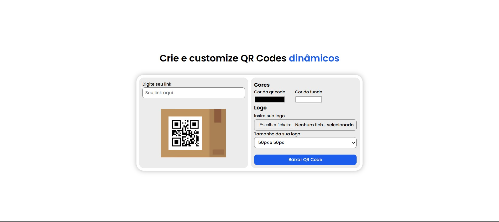

# Gerador de QR Code Customizável

## 📸 Preview



## 🖌️ Sobre a interface

- Interface limpa, minimalista e intuitiva
- Paleta de cores suave e agradável, mas sem perder a sofisticação
- Tipografia clara e direta, facilitando a leitura e navegação

## 🔥 Sobre a experiência

- **Fácil de usar: O usuário insere o link, escolhe as cores e faz o download sem dificuldades**
- **Customização acessível: Permite que qualquer alteração seja feita em alguns milésimos para que não haja alterações desnecessárias caso o usuário faça algo que não deseje**
- **Layout responsivo: Funciona bem em diferentes tamanhos de tela**
- **Foco na eficiência: Tudo que o usuário precisa está visível em uma única tela, sem navegação desnecessária**

## ✨ Funcionalidades

- ✅ Geração instantânea de QR Code
- 🎨 Personalização de cores (QR code e fundo)
- 🖼️ Inserção de logo no centro
- 🧱 Escolha do tamanho da logo no QR Codemote
- 📥 Download do QR Code gerado (.png)

## 🚀 Tecnologias utilizadas

- **HTML** para a estruturação do conteúdo
- **CSS** para estilização visual
- **JavaScript** para implementar a funcionalidade de geração do QR code
- **Biblioteca utilizada** (https://cdn.jsdelivr.net/npm/qr-code-styling/lib/qr-code-styling.js)

## 👨‍💻 Como rodar na sua máquina

1. Clone este repositório:
```bash
    git clone https://github.com/rainannogueira/gerador-de-qr-code-customizavel.git
```

2. [Ou acesse aqui para ver o projeto](https://rainannogueira.github.io/gerador-de-qr-code-customizavel/)