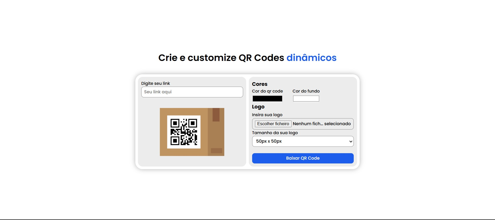

# Gerador de QR Code Customizável

## ✨ Funcionalidades

- ✅ Geração instantânea de QR Code
- 🎨 Personalização de cores (QR code e fundo)
- 🖼️ Inserção de logo no centro
- 🧱 Escolha do tamanho da logo no QR Code
- 📥 Download do QR Code gerado (.png)

## 📸 Preview

## 🚀 Tecnologias utilizadas

- HTML
- CSS
- JavaScript
- Biblioteca utilizada (https://cdn.jsdelivr.net/npm/qr-code-styling/lib/qr-code-styling.js)
